# `resample_image`

Synopsis:  _reproject by resampling_


## _reprojecting_

Here we describe the operation of `reprojecting` as taking an image with one Coordinate Systems (CS) and 
converting it into another CS.  In the astronomical community we usually talk about World Coordinate Systems (WCS)
which takes image pixels location and converts it to a celestial location

$
\left( x,y \right)  \stackrel{\mathit{WCS}}{\longrightarrow} \left(\alpha,\delta\right)
$
    
So by reprojecting the image we are trying to perform the following operation


$
\left( x,y \right)  \stackrel{\mathit{WCS_{i}}}{\longrightarrow} \left(\alpha,\delta\right)  \stackrel{\mathit{WCS_{o}^{-1}}}{\longrightarrow} \left( x',y' \right)
$


The trick is that the WCS transforms are not linear.  That is you cannot just adjust the WCS desription itself to 
reproject the image pixels, the pixel values themselves must be recomputed with the new WCS definition.


## remapping

The most basic form of reprojection is to simply take the grid of $(x,y)$ pixel values map them through the coordinate systems to create the output image.

$
P_o(x',y') = P_i(x,y) \ \ \ \forall (x,y) \in P
$

where $P$ is the pixel value at the given coordinates.

The first challenge is understanding exactly what $(x,y)$ are?  Are they the center of the pixel?  Are they the bottom left corner of the pixel?


>  Aside:  In image processing circles, the pixels are number starting in the upper left corner of the image.
>  In astronomical circles, the pixels are numbered starting in the lower left corner, effecting a flip about the
>  X-axis.  This document will use the astronomical, lower-left, convention.

Why does it matter?  

Since $(x,y)$ are discrete, $(x',y')$ will also be discrete.  However, given that the WCS transforms are non-linear,
there is no guarantee that $(x',y')$ will be __unique__.  Another way to say it is

1. Different $(x,y)$ locations may map to __same__ $(x',y')$ in the output array.
2. There maybe some $(x',y')$ that __cannot__ be obtained with any $(x,y)\in P$.

The practical upshot is that there can be _holes_ in the output image causes by the discrete nature of the 
pixel locations.  When the WCSs are nearly identical these holes often form patterns akin to the Morie effect 
common in CRTVs.

### Example 1: remap input to output

Consider the following example:  Suppose we have an image that was created with a binsize=2.  We want to 
remap it to match an image with a binsize=1.  

Consider the following input image

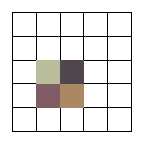


The colors are arbitrary and just show the different non-zero pixel values.  Now, if this image were remapped by 
simply scaling the coordinates by a factor of 2, the output looks like:

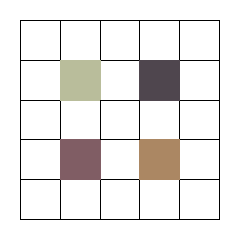

This illustrates point ##2 above.  As only the discrete location of the pixels in the input were mapped to the output, there are pixels in the output that are unreachable.  In this example it introduces a horizontal and vertical stripe that runs though the output image.

### Example 2: remap output to input

But what if we go in the other direction?  Instead of mapping input pixels to output pixels, what if we reverse the operation

$
\left( x',y' \right)  \stackrel{\mathit{WCS_{o}}}{\longrightarrow} \left(\alpha,\delta\right)  \stackrel{\mathit{WCS_{i}^{-1}}}{\longrightarrow} \left( x,y \right)
$

$
P_o(x',y') = P_i(x,y) \ \ \ \forall (x',y') \in P_o
$

Doesn't that solve the problem?

Unfortunately not.  

Taking a look at our input image again

 

if we now show the location of the pixel centers in the output image

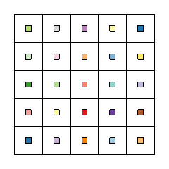

and then show where those pixels map back to input

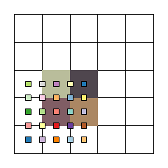

we see that the same input location $(x,y)$ is mapped to multiple pixels in the output (the 1st problem mentioned above).

> The left and bottom edges are included in the pixel

The result then is that the input pixels are replicated multiple times in the output as shown here

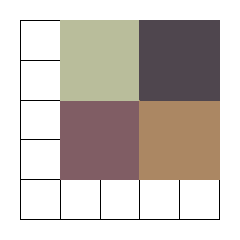

While at first this may be aesthetically pleasing, consider that we have now **quadrupled** the total pixel values 
(in astronmy terms, quadrupled the flux), which is also unacceptable. 

Now, this is a somewhat simple case:  Since we know the bins are (in this example) just a uniform, linear scaling factor, the output image could be renormalized by a factor of $0.25$.  However, when dealing with more complex WCS transforms that is not an option.

## `reproject_image`


The problem with the mapping technique is that we only consider the pixel at discrete, quantized locations.  Instead we need to
consider the pixel as 2D geometry (ie square) with finite area.   

Only when working with continuous variables and continuous transforms can we produce a flux preserving reprojected image.

The `reproject_image` tool does this by considering each pixel to be a **square** centered at $(x,y)$.  It then converts the corners of the pixel boundary through the WCS transforms to produce a **polygon** in the output image pixel. 


$
\left( x' \pm 0.5 ,y' \pm 0.5 \right)  \stackrel{\mathit{WCS_{o}}}{\longrightarrow} \left(\alpha,\delta\right)  \stackrel{\mathit{WCS_{i}^{-1}}}{\longrightarrow} \left( x,y \right)
$


> The `resolution` parameter allows users to create a finer grid (that is a polyon with more sides).


This polygon may overlap multiple output pixels.  For each output pixel the polgyon overlaps, it computes the geometric area of the overlapping region, and the distributes that fraction input pixel value into the output pixel.

The process is repeated for all output pixels, accumulating the fractional pixel coverage of each input pixel.


### Example

Consider this simple image

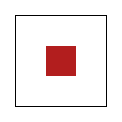

which is reprojected to a WCS that has a 0.25pixel shift in X and 0.33 pixel shift in Y.


The input pixel maps to 4 output pixels, ie 4 polygons (here rectangles) with varying amount of overlap.  `reproject_image` computes these area 

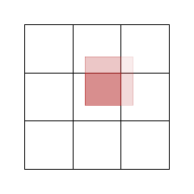

and then accumlated the output pixel values with those weighted values.

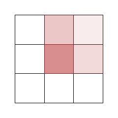


The output then is an area weighted, flux preserving sum of the input pixels.

_What more do we want?_

## `resample_image`

The `reprojet_image` algorithm works very well for images that represent continuous quanties.  For example

- exposure maps
- PSF maps

however, for images with discrete, integer, pixel values, the discrete nature of the pixel values is lost.

For X-ray data analysis this is very important.  The "counts" image, an image representing the number of
photons detected at a certain location, is one of the primary science products.  It is described by Poisson statistics
(aka counting statistics).  Many algorithms that assume Poisson statistics require that the input image be
integer pixel values; however that is not possible 

> Just trying to scale floating point values to 'integerize' them doesn't work for data in Poisson regime (ie small pixel values)

`wavdetect` and `csmooth` are two popular CIAO tools that require the input image be an integer datatype.  They both
perform their algorithms with the assumption of Poisson statistics, and cast the input image to an long (32bit) integer. 

Since `reproject_image` outputs pixel values that represent an area weighted sum, the output is real-valued.
This results in a **truncation** of the pixel values and lost counts (or flux), when used in those tools.
Consider if, in the above example output


If the original pixel value was $1$, all of the output pixel values would be $<1$, which when truncated means that all
the integer pixel values will be $0$.  In X-ray astronomy there are many pixels with a value of $1$ so this is a very
common problem.

### _A different approach_

The problem with `reproject_image` is that it distributes an arbitrary fraction of the pixel value when reprojecting.
The discrete nature of integer data is therefore lost.  

To preserve the the discrete pixel values we have to **resample** the image.  The idea is to take the input pixel, and 
one-by-one resample the pixel value and reproject each count into the output image.


$
P(x',y')+=1  \ \ \ \forall k \in \mathcal{I} [1:P(x,y)] \ \ \ \forall (x,y) \in P
$

where

$
(x,y) \stackrel{\mathit{WCS}}{\longmapsto} (x',y')
$

When we do this we cannot just take the discrete $(x,y)$ locations and perform the above transform.  This will simply result in the `remap` algorithm discussed above.

Instead we need to consider the pixel value as in integrated quantity, with counts accumulated over the pixel area.  When we do this then we can treat each individual count as having come from a _random_ location _within_ the pixel.

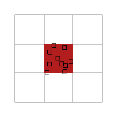

Then if we convert each random _subpixel_ location through the WCS:

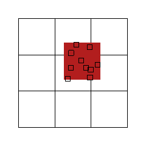

and then accumulate the counts in the output :

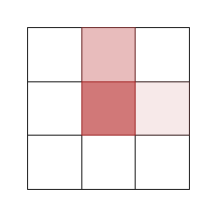

This then is the reprojected image by resampling the input.

Of course this is now a random process, so the output will have some randomization.  Consider that these two 
images (left) also show the same 10 counts shown above with a different random position, and the resulting output images (right).

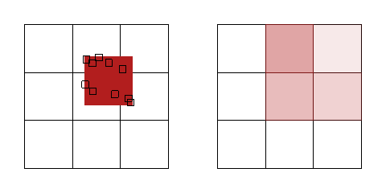

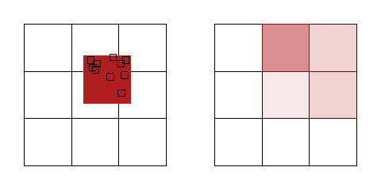

All three of these images are equally valid reprojections by randomly resampling the input image.

### Optimization

The resampling algorithm shown above is the brute force approach to reprojection.

For each count in each pixel it requires sampling the random stream twice (independently for X and Y).  For a large number of pixel and/or pixels with generally large values, this may exhaust the random number stream, causing the reprojected pixels to become correlated.  

It also has to compute the 

$
\left( x,y \right)  \stackrel{\mathit{WCS_{i}}}{\longrightarrow} \left(\alpha,\delta\right)  \stackrel{\mathit{WCS_{o}^{-1}}}{\longrightarrow} \left( x',y' \right)
$

coordinate transformation for each count in each pixel, which is generally an expensive computation (lots of trig functions).

We can optimize this process by realizing that we do not care _where_ in the reprojected pixel the sampled count ends up.  Rather, what we want is that the number of counts in the reprojected accounts should be consistent, in a statistical sense,  with the fraction of the pixel area.  Luckily we know how to compute this.  

Using the fractional polygon/pixel overlap algorithm from `reproject_image` we 
know what fraction of the pixel counts are expected to end up in which output pixels


We then just need to think about these fractional areas as a probability distribution.  

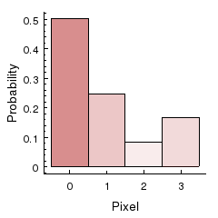


> Note: the order of the pixels is irrelevant and arbitrary.  The numbering here is clockwise from the center pixel.

Then all we do is compute the cumulative probability distribution (CDF)

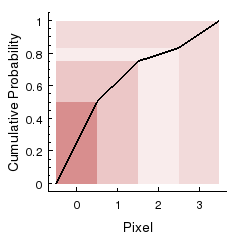

Now for each count in each pixel we only need to sample 1 random value $\mathcal{R}(0:1)$ and then use the CDF to lookup which pixel to resample it into.  Philosophical debates about open vs. closed ranges are ignored.

This requires half as many random samples compared to the brute force method.  On the down side, it also does require at least 4 WCS transforms for any non-zero pixel whereas the brute force method is only one per count.  But if the number of non-zero counts is greater 4, this method preforms better as the number of WCS transforms per pixel is constant.  

The output from this algorithm is the same as the brute force method, ie these will all be valid outputs

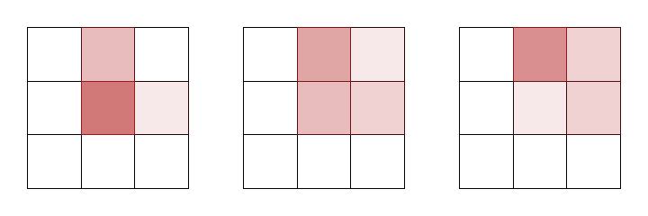

---

## Real World Example

Below is a real-world example using data for `OBS_ID=4425`.

The image below had the WCS shifted 

```bash
fluximage infile="acisf04425_repro_evt2.fits" outroot="test" bin="1"
dmcopy infile="test_broad_thresh.img" outfile="shifted_test_broad_thresh.img" 
wcs_update infile="shifted_test_broad_thresh.img" outfile="" transformfile="" \
  wcsfile="shifted_test_broad_thresh.img" deltax="0.35" deltay="-0.67"  \
  rotang="0" scalefac="1"
```

and then it is resampled back to the original WCS using `resample_image` 

```bash
resample_image infile="shifted_test_broad_thresh.img" \
  matchfile="test_broad_thresh.img" outfile="resampled.out" \
  resolution="1" quantum="1" coord_sys="world" randseed="12345" 
```


The left image is the orignal image with the shifted WCS.  The center image is the result of running the `reproject_image` tool.  Note that the pixel values are now floating point values.  The right image is the output from the `resample_image` tool.  The resample output is not identical to the input since the resampling is done via random sampling.

### A greedy alternative?


Surely some Computer Science geek will come along at some point and say 

    Hey, can't I just use a greedy algorithm here?
    
That is can't I just 

* sort the probabilities from highest to lowest, call them $q_i$ 
* take the first N counts, where  $N = q_0 * P(x,y)$ and assign those counts to highest probability pixel
* subtract $P'(x,y) = P(x,y)-N$
* repeat with the next lowest probabilty until $P'< q_i$  and then 
* put any extra counts into the last bin?

That way you get to skip doing any randomization.  **Score!**

Unfortunately this doesn't work.  We're still dealing with integer counts and they don't work-n-play well with 
continous value probabilities.  For example using this example data with a 10 counts pixel, we would get:


| Pixel | Prob    | Counts|  Frac  |
|-------|---------|-------|--------|
|  0    | 0.5025  | 6     |  0.6   |
|  1    | 0.2475  | 1     |  0.1   |
|  3    | 0.1675  | 1     |  0.1   |
|  2    | 0.0825  | 2     |  0.2   |


Statistically this output is inconsistent with the area weighted probabilities.  In fact the pixel with the smallest fractional area contains the second highest
number of counts.  This could be fine if it were a random fluctation; but we would get this 
for **all** 10 count pixels everywhere in the image.

As soon as you impose any ordering of pixels you begin to bias the results and thereby invalidate the results.

## Summary

The `resample_image` tool work complements the existing `reproject_image` tool by respecting the 
Poission nature of X-ray data.


