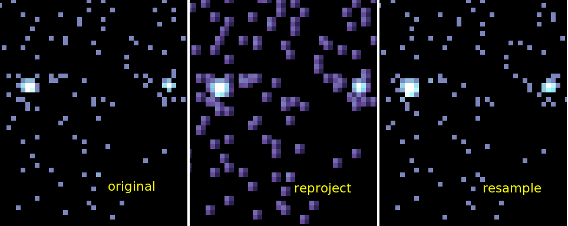

# `resample_image`

Reprojects an image by resampling the integer pixel values onto
the new output WCS.

This is a prototype [CIAO](http://cxc.cfa.harvard.edu/ciao) tool to 
reproject an image from one World Coordinate System (WCS) to another.
The existing [`reproject_image`](http://cxc.cfa.harvard.edu/ciao/ahelp/reproject_image.html)
tool does this by dividing the flux in each input pixel into each output 
pixel.  This is inappropriate when then input image has integer values
(eg X-ray counts).

